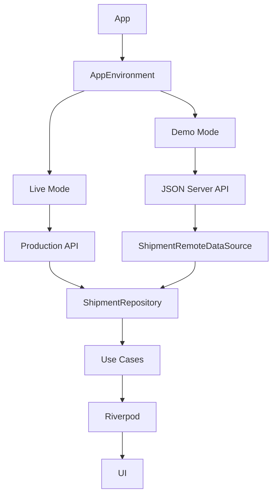
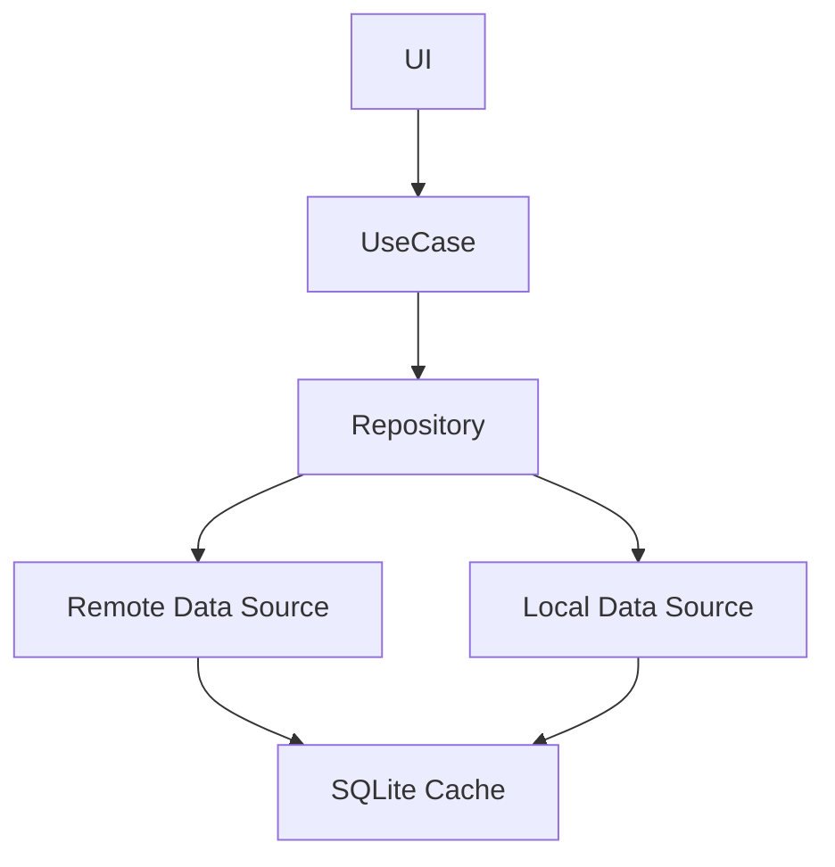

## Live/Demo Architecture

```mermaid
graph TD
    App --> AppEnv[AppEnvironment]
    AppEnv --> Demo[Demo Mode]
    AppEnv --> Live[Live Mode]
    
    Demo --> JSON[JSON Server API]
    Live --> Prod[Production API]
    
    JSON --> DataSource[ShipmentRemoteDataSource]
    Prod --> Repo[ShipmentRepository]
    DataSource --> Repo
    
    Repo --> UseCases[Use Cases]
    UseCases --> Riverpod
    Riverpod --> UI
```

## Offline Architecture

```mermaid
graph TD
    UI --> UseCase
    UseCase --> Repository
    Repository --> Remote[Remote Data Source]
    Repository --> Local[Local Data Source]
    Remote --> SQLite[SQLite Cache]
    Local --> SQLite
```